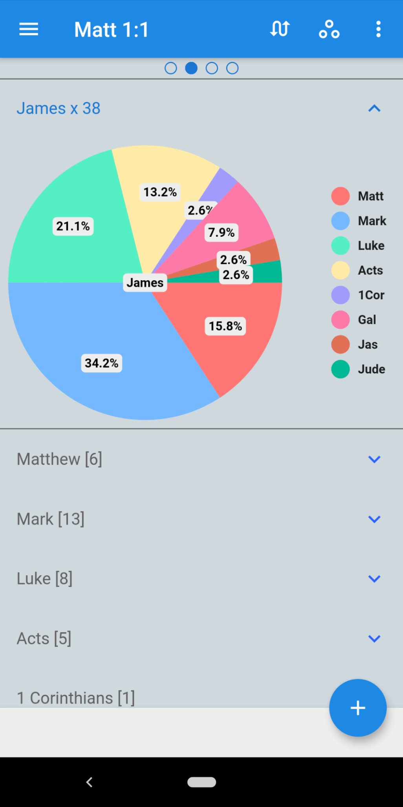

# Unique Bible App Hybrid
Integrating the desktop and mobile versions of UniqueBible.app into a single application with a unified cross-platform interface.

# Bringing TWO Versions into ONE

In this hybrid project, we are rewriting everthing to integrate our best two apps into a single one.

Let us first review two different versions of "Unique Bible App" we have already developed:

<b>Desktop version:</b>

Plaforms: Windows, macOS, Linux, Chrome OS

Source: https://github.com/eliranwong/UniqueBible

Programming language: Python

Gui framework: PySide2 [Python API for the Qt framework]

Database formats: mainly sqlite

Pros: Comprehensive features for bible studies, offline marvel.bible resources, expandable resources, capability to import resources from various bible softwares, users can customise resources.

Cons: Difficult to install for non-technical users.  General users don't know how to setup python and dependencies.

<b>Mobile version:</b>

Plaforms: iOS, Android, Chrome OS; can also be installed on Windows, macOS through 3rd-party "BlueStacks"

Source: https://github.com/eliranwong/DartBible-Flutter

Programming language: Dart

Gui framework: Flutter

Database formats: json + sqlite

Pros: easy to be installed, can be installed on more platforms, tts support better than the desktop version

Cons: less features compared to the desktop version, resources not expandable

# Why "Hybrid"

By "Hybrid", we mean to integrate all the good sides of the deskop and mobile versions and bring further improvement on interface and resources.

Platforms:
* Windows 10
* macOS
* iOS
* Android
* Chrome OS
* Linux (need to check)

Programming language: Dart

Gui framework: Flutter

Database formats: sqlite + json

# Progress

what have been done in this hybrid project:

* General UI Layout
* codes on loading preferences
* codes on bible navigation
* codes on changing bible version
* codes on reading parallel verses
* codes on reading parallel chapters
* codes on scrolling parallel chapters with exact corresponding verses
* codes on search bible, display results book by book
* codes on piechart to present search result

#Screenshots

[screenshot_ui_layout.png]

[screenshot_search_results.png]
