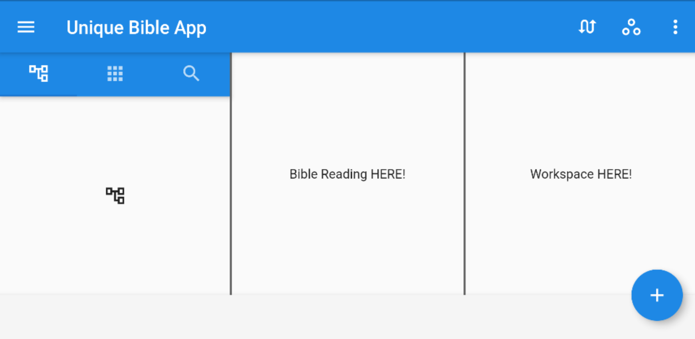

# Unique Bible App Expanded
Integrating the desktop and mobile versions of UniqueBible.app into a single application and a cross-platform interface.

# THE BEST TWO INTO ONE

We have produced:

- a desktop version: https://github.com/eliranwong/UniqueBible

- a mobile version: https://github.com/eliranwong/DartBible-Flutter

In this project, we are bringing the best features of the two projects into a single application with a unified interface across all target platforms:
* Windows 10
* macOS
* iOS
* Android
* Chrome OS
* Linux

# Progress

UI Layout:

[screenshot_ui_layout.png]
